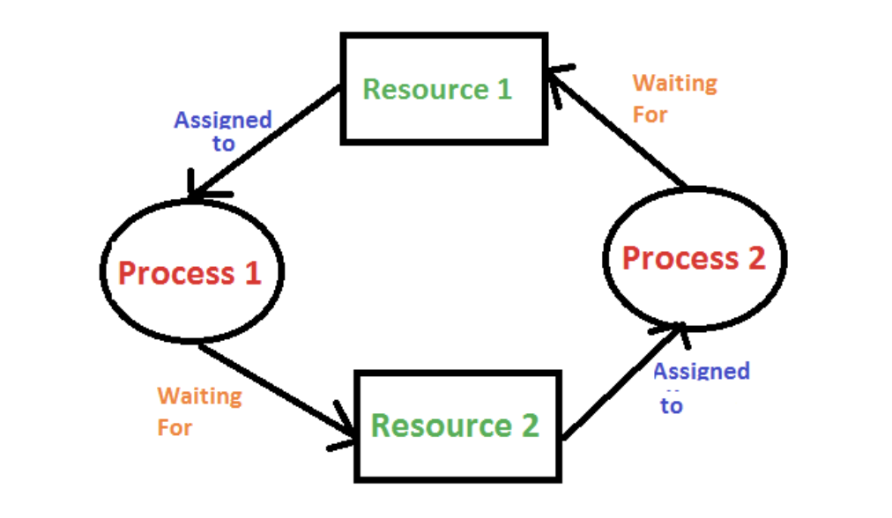

# Philosophers (Filozofların Akşam Yemeği Problemi)

### Projenin isterleri

- Yuvarlak bir masanın etrafında filozoflar oturmuş ve aralarında birer çatal var. Önlerindeki spagettiyi yiyebilmek için filozoflar iki çatalı aynı anda kullanmak zorundalar
.
burda filozoflar threadleri temsil ediyor, çatallar ise kaynakları
-  eat - think - sleep sadece bu üç etkinliği gerçekleştirebiliyorlar ve iki etkinlik aynanda yapılamaz ve mutlaka birini yapıyor olmalı
-  Filozof sayısı kadar çatal var ve spagetti iki çatalla birlikte yenilmelidir
- Filozof yemeğini bitirince çatalını tekrar masaya koyar ve uyumaya başlar. Uyandıktan sonra tekrar düşünmeye başlarlar. Yemek yedikten sonra uyumak ve uyandıktan sonra düşünmek zorunda
- filozof açlıktan öldüğünde simülasyon durur.
- her bir filozof bir thread dır.
- Her filozof çifti arasında bir çatal vardır. Bu nedenle, birden fazla filozof varsa, her filozofun sol tarafında bir çatal ve sağ tarafında bir çatal vardır. Sadece bir filozof varsa, masada sadece bir çatal olmalıdır.
- Filozofların çatalları çoğaltmasını önlemek için çatal durumunu her biri için bir mutex ile korumalısınız.
- data races olmamalıdır.
- Bir filozofun öldüğünü bildiren bir mesaj, filozofun gerçek ölümünden en fazla 10 ms sonra gösterilmelidir.

- program çalışırken alacağı argümanlar şu şekilde olacak;
```
number_of_philosophers filozof sayısı ve fork sayısı
time_to_die (milisaniye) açlığa dayanma süresi, bu süre boyunca aç kalan filozof ölür
time_to_eat (milisaniye) yemek yeme süresi, bu süre boyunca filozoflar iki çatal tutacak
time_to_sleep (milisaniye) uyku süresi
number_of_times_each_philosopher_must_eat (opsiyonel) filozofun kaç kere yemek yiyeceği, belirtilmemişse filzoflar ölene kadar program devam eder.
```

- her filozofun bir sayısı olmalı 1'den number_of_philosophers e kadar. 
- filozoflar masaya numaralarına göre sırasıyla oturur

- programın çıktıları şu şekilde olacak;
```
 durum değişiklikleri aşağıdaki gibi çıktı verilecek
timestamp_in_ms X has taken a fork
timestamp_in_ms X is eating
timestamp_in_ms X is sleeping
timestamp_in_ms X is thinking
timestamp_in_ms X died
```
burada X filozof sayısı, timestamp_in_ms etkinliği 
gerçekleştirdiği süre

./philo philo_num die eat sleep yemesayisi

### Kavramlar

Data races : Bir thread bir değişkene yada değiştirilebilir bir nesneye erişirken aynı anda başka bir thread ona yazmaya çalışır. Bu durumda kod beklenmeyen çıktılar verebilir.
- Race Condition kavramı Data Race kavramından farklıdır
.
Race Condition : Olayların zamanlaması veya sırası bir kod parçasının doğruluğunu etkilediğinde Race Condition durumu oluşur.
 aynı veri üzerinde işlem yapan iki farklı thread düşünelim, ikiside int olan bu değişkeni arttırıyor olsun. Her bir thread veriyi okur, arttırır, belleğe yazar. İşte böyle bir durumda threadler veriyi aynanda okursa arttırma işlemini ikiside yapar, ve değer bir kere arttırılmış olur. Eğer senkron bir şekilde arttırsalardı iki kere arttırılmış olacaktı
Race Condition durumu yalnızca multi core işlemcilerde meydana gelir. Single core bir işlemcide bu durumla karşılaşmanız çok olası değildir. Lakin günümüz işlemcilerinin çoğu multicore :D
- Mutexler ile data races i önleyeceğiz. Senkron bir şekilde paylaşılan veriye erişeceğiz. Bir başka deyişle çatallar senkron bir şekilde kullanılacak
// Mutex : 
- Deadlock : iki yada daha fazla işlemin (process - thread) devam etmek için birbirlerini beklemesi ve sonuçta devam edememesidir. Örnek olarak her filozofun bir çatalı eline alması ve hiçbirinin yiyememesi durumudur.
Oluşması için Coffman şartları gereklidir (mutual exclusion, hold and wait, no preemption, circular wait)

[incele](https://www.geeksforgeeks.org/introduction-of-deadlock-in-operating-system/)
### Threads vs Processes
ikisi birbirine benziyor ama karıştırmayalım. Bir process birden falza thread içerebilir. Sistem kaynakları processdeki tüm threadlar arasında paylaşılır. Yanii threads oluşturulduğunda processdeki datalar ne ise tüm threadler bunları kullanır ama fork yaptığımızda oluşan iki farklı process için tüm datalar dublicate edilir. Her bir process için her bir data farklı adreste tutulur.

// -Wall bir dizi warning etkinleştirilir, ama tümü değil
// -Wextra ekstra warningler etkinleştirilir
// -Werror warningleri error a dönüştürür
// -w tüm warningleri engeller
// -g hata ayıklama bilgileri üretir. ??

### Kullanılacak fonksiyonlar

 // Biz bir thread oluşturduğumuzda main threadin yanında bir thread daha oluşmuş olur, toplamda iki threadimiz olmuş olur
// iki thread oluşturursak toplam 3 threadimiz olur

//pthread_t abstract type is implemented as an integer (long unsigned nt) (4 byte or 8 byte) thread ID

pthread_create() ile thread çalışmaya başlar
pthread_join() ile thread çalışmayı bitirir, ikinci parametreye verdiğimiz değişkene
threadin fonksiyonunun return ettiği void* tipindeki değer atanır. Örneğin
```C
 int* a;
 pthread_create..
 pthread_join(&th, &a);
```
bir döngü ile birsürü thread oluşturursak
pthread_create() pthread_join() fonksiyonlarını aynı döngünün içinde kullandığımızda mutex ile bu durumu kontrol altına aldığımızda dadad da dahada da biri başlar biri biter sıra ile çalışır biterler
ancak biz kaynaklar çakışmıyor ise aynı anda çalışan threadler istiyoruz


// pthread_detach();
// pthreaad_mutex_t my_mutex; mutexi tanımlıyoruz
// pthread_mutex_init(&my_mutex, NULL); başlatıyoruz
// pthread_mutex_lock(); artık kilitleyebiliriz
// pthread_mutex_unlock(); kilidi açıp 
// pthread_mutex_destroy(&my_mutex); mutexi kaldırıyoruz ayrılan belleği kaldırmak içn 

### Garson çözümü

Garson, sürekli olarak masada boş duran ve filozoflar tarafından yemek için kullanılan çatalların sayılarını takip etmektedir. Bir şekilde her filozof, masadan çatal alabilmek için garsonun iznini istemek zorundadır. Şayet garson izin vermezse filozof masadan çatal alamaz. Bu çözümde filozofların kıtlık problemi (starvation) ile karşılaşmaları engellenir çünkü mantıklı bir garson tasarımı, bütün filozoflara yemek imkanı tanır. Aynı zamanda ölümcül kilitlenme (deadlock) ihtimali de çözülmüştür çünkü garson hiçbir filozofu sonsuza kadar bekletmez. Yani filozofların birbirini bekleyerek sonsuza kadar yaşlanması sorunu çözülmüştür.

Çözümün daha iyi anlaşılabilmesi için, garsonun, saat yönünde masada döndüğünü, düşünelim. O anda işaretlediği filozof yemek yiyor, sonraki yemiyor sonraki yiyor ve böylece kaç filozof farsa, sırayla bir yiyor bir yemiyor şeklinde düşünülebilir. Bu durumda her filozofun yemek yemek için yeterli çatalı (veya sopası) bulunuyor demektir. Sonra garson, sırasıyla bir yönde (örneğin saat yönünde) dönerek masayı dolaşmakta ve sıradaki filozofa yemek yedirmekte (ve dolayısıyla sıradaki filozoftan sonraki yememekte ve sonraki yemekte ve böylece bütün masadakiler bir yer bir yemez şeklinde işaretlenmektedir).
### Algoritma
int wait_index = 1;

wihle  wait_index++;

örrneğin 7 filozof olsun, filozof sayısı tek sayı olduğundan tekler yesin çiftler yesin yapamayız. Sıra ile her filozof bir tur bekleyecek, bekleyen filozoftan sonrası için sırayla birer atlayarak filozoflara yeme komutu vereceğiz.
tabloda Y ler yemek yemeyi
X ler beklemeyi temsil ediyor
| 1. | 2. | 3. | 4. | 5. | 6. | 7. |
|----|----|----|----|----|----|----|
| X  | Y  | X  | Y  | X  | Y  | X  |
| X  | X  | Y  | X  | Y  | X  | Y  |
| Y  | X  | X  | Y  | X  | Y  | X  |
| X  | Y  | X  | X  | Y  | X  | Y  |
| Y  | X  | Y  | X  | X  | Y  | X  |

yeme komutu filozofun rFork ve lFork u mutex_lock yapması anlamına geliyor, yeme süresi bitince unlock yapılacak diğer tura geçilecek